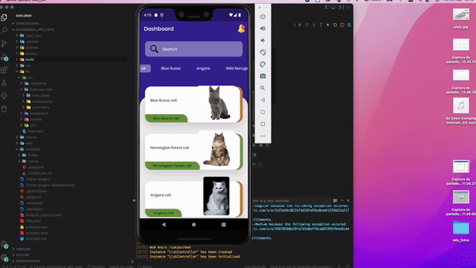
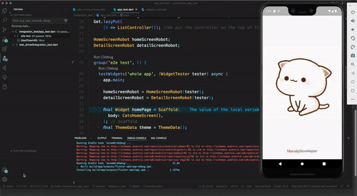

# Flutter Cats App
The objective of this flutter application about asynchronous programming in Dart II.
To demostrate 

## how to implemented integration test e2e using pattern robots

- ✅  Clean Architecture
- ✅  Testing
- ✅  Performance
- ✅  Custom Animations

## To get started 
To start run the following commands 

git clone [repo_url]

flutter pub get

flutter run --dart
 

## Flutter packages

 flutter_launcher_icons
  flutter_lints
  flutter_localizations:

  intl: 
  flutter_layout_grid: 
  flutter_rating_bar: 
  flutter_svg:   
  google_fonts: 
  get:

### [LICENSE: MIT](../LICENSE.md)
